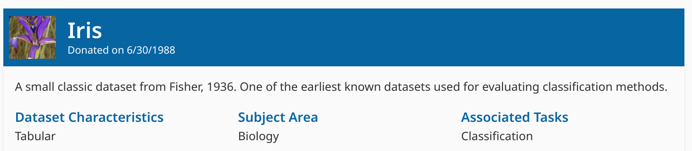
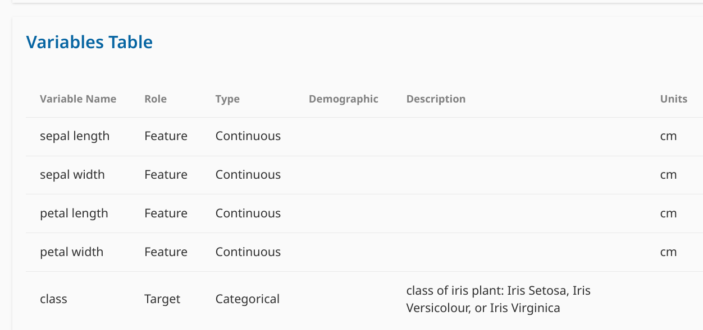
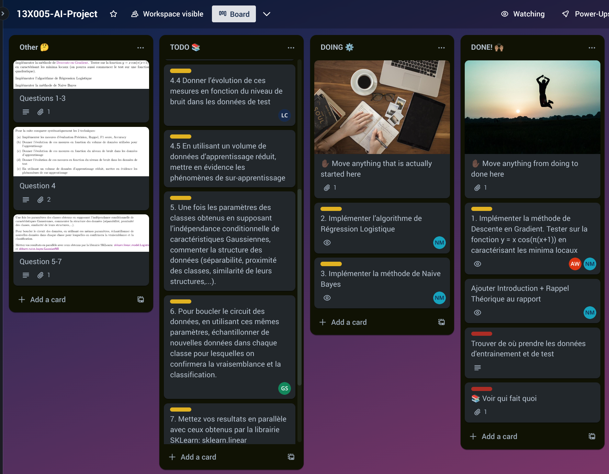

# 13X005 AI Project - Logistic Regression & Naive Bayes

End of semester AI Project on Logistic Regression and Naive Bayes using the famous ["Iris"](https://archive.ics.uci.edu/dataset/53/iris) dataset.

Assignement Pdf:

[regressionLogistique.pdf](regressionLogistique.pdf)

 

**DataSet Used:**

## Todo

Link to trello used to manage todos:  [https://trello.com/b/xhglaB3g/13x005-ai-project](https://trello.com/b/xhglaB3g/13x005-ai-project)

**Preview:** 

## Building & Runing

Poetry was used to simplify the project & dependencies setup, 
i.e. avoid problems related to python/package versions as well as the _"It works on my machine"_ problem.

- **Dependencies:**  
    This project manages depency with [poetry](https://python-poetry.org) (installable with `pip install poetry`).  
    To install the required dependencies, simply run `poetry install`. Note that the makefile should do that automatically if you don't already have a `poetry.lock` file.  

    If for some reason you don't want to use poetry, you can see a list of dependencies from [here](pyproject.toml),  

- **Run:** To run it just use `make`.  

- **Test:** To run the tests use `make test` or to test the effiency (f1-score) of the models use `make test_model` as some tests can be quite verbose.  

### Editing the report

- You can directly edit the markdown version in [report/report.md](report/report.md) and use `make report` to convert it from markdown to latex and from latex pdf.
([pandoc](https://pandoc.org) and [pdflatex](https://www.latex-project.org/get/) are required for this to work. Pandoc should be installed by default on most linux distributions.)

- The report follows the LaTeX template defined in [preamble_ai_project.sty](./report/preamble_ai_project.sty), which looks like this:
[pdf-report](./report/report.pdf)

- The citations are in the file [report/references.bib](report/references.bib) and can be called with `\cite{citation-key}`.

### Submission

To build a zip archive containing the relevant files for submission, run `make package` and an archive named `ai-project-group3.zip` will get created at root of the project.

## Authors

- [Gregory Sedykh](https://github.com/gregorysedykh)
- [Arkanthara](https://github.com/Arkanthara)
- [CTGN](https://github.com/CTGN)
- [Aviel20002](https://github.com/Aviel20002)
- [Noah Munz (Me)](https://github.com/David-Kyrat)
