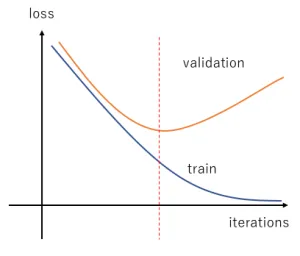
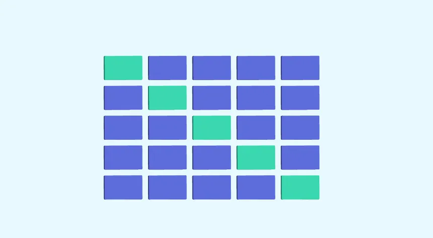
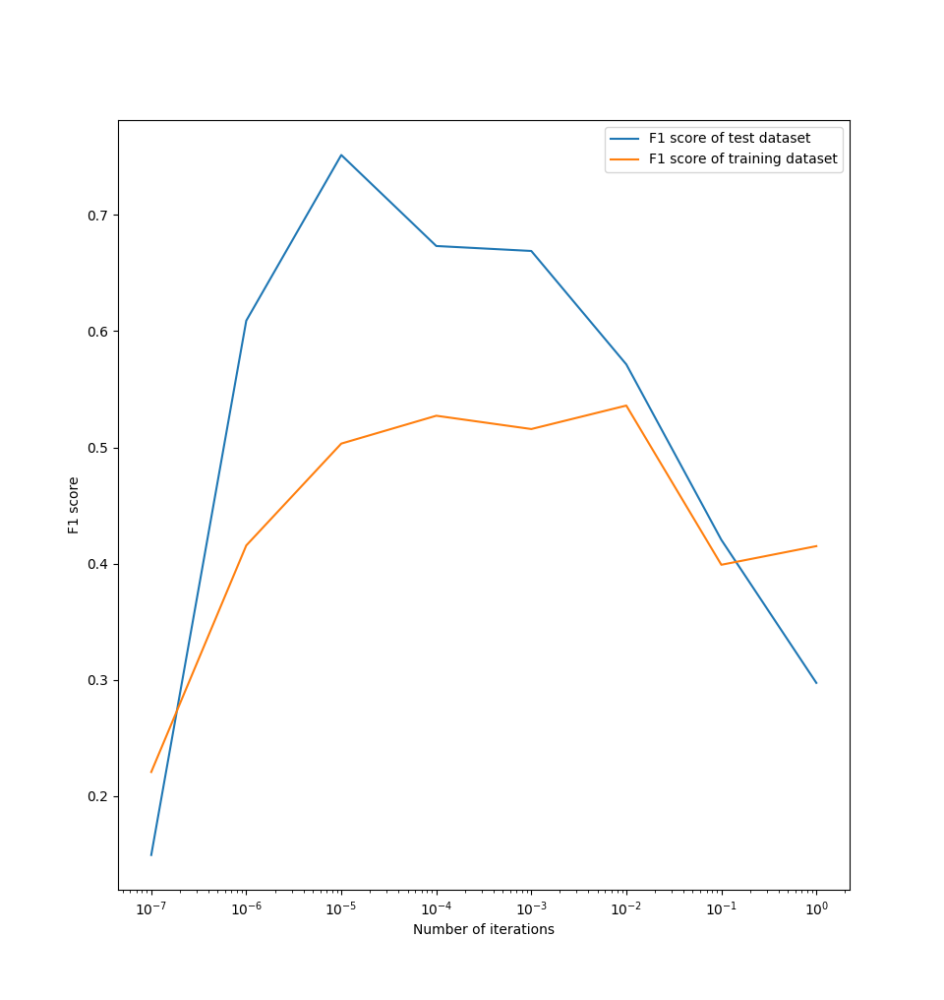
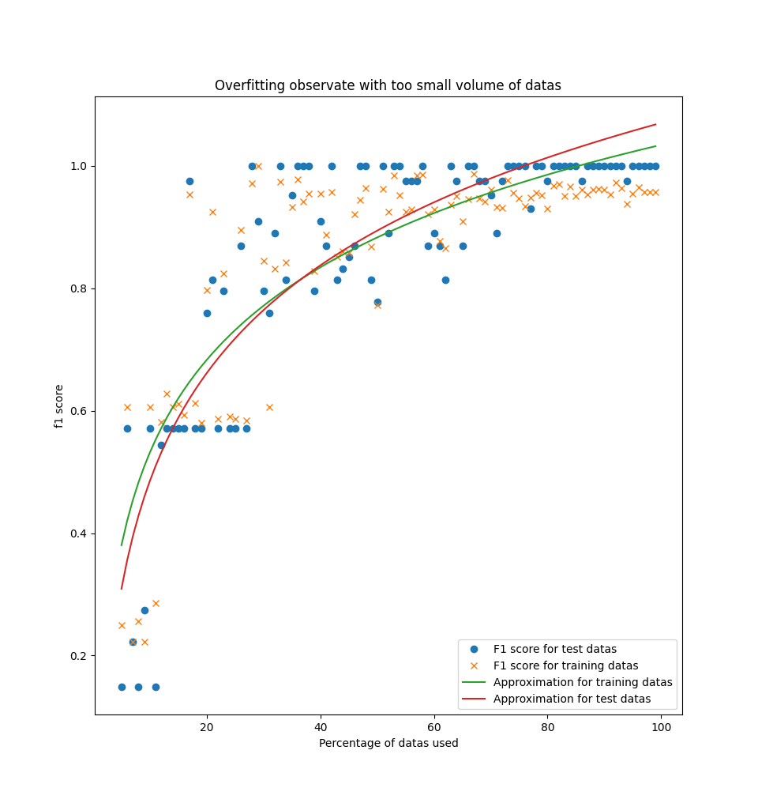
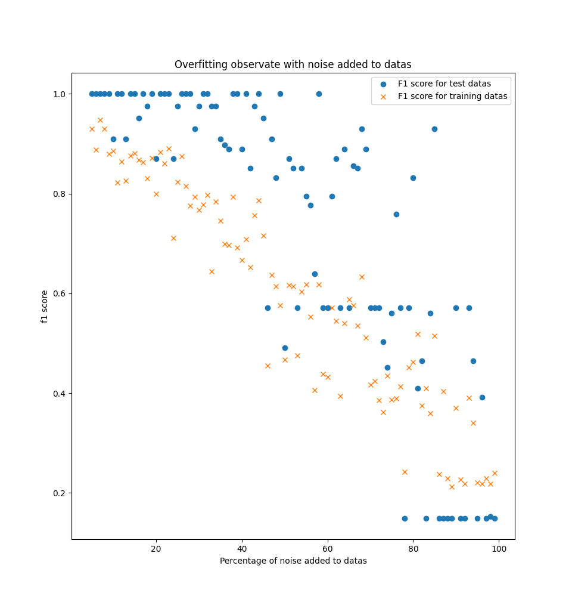

# Sur-apprentissage

On ne veut pas apprendre le bruit des données d'apprentissage !

# Sur-apprentissage: exemple

{width=70%}

# Sur-apprentissage: graphique

{width=70%}

# Comment éviter le sur-apprentissage ?

Validation croisée !

# Autres techniques ?

- Ajout données d'apprentissage modifiées (pour plus de généralisation...)
- Retirer des caractéristiques
- ...

# Concrêtement, dans le projet

Dans le projet, pour montrer le phénomène de sur-apprentissage:

- Ajout de bruits aux données d'apprentissage
- Volume réduit de données
- Modification du nombre d'itérations

# Résultats obtenus

\center {width=80%}

# Résultats obtenus

\center {width=80%}

# Résultats obtenus

\center {width=80%}
