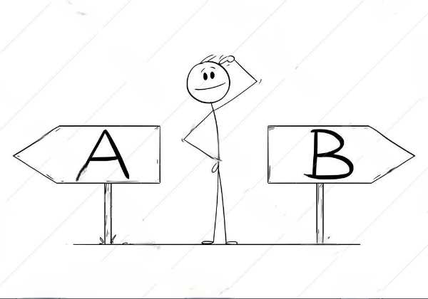

<!--

-->

# Régression Logistique

---

# Régression logistique binaire: principe

---

## Régression logistique binaire: idée

{width=80%}

---

## Régression logistique: fonction d'estimation

Fonction sigmoïde
$$\sigma(z) = \frac{1}{1 + e^{-z}}$$

Caractérisiques:

- Comprise entre 0 et 1 $\Rightarrow$ probabilité !
- Point d'inflexion à 0.5

Idée:

- établir un seuil afin de prédire le label $Y$

---

## Entraînement du modèle

**But:**

- maximiser la probabilité $P(Y = y | X)$ pour $y$ la valeur d'entrainement du label.

Mais on a la descente en gradient...

$\Rightarrow$ transformer le problème en problème de minimisation !

$\Rightarrow$ `Negative Logarithm Likelihood`

---

# Régression logistique multinomiale: principe

---

## Généralisation de la fonction sigmoïde en fonction softmax

$$P(Y = k | X) = \frac{1}{1 + e{-X \theta^T}}\ \rightarrow \ \frac{e^{X \theta_k^T}}{\sum_i^N e^{X \theta_i^T}}$$

---

# Entraînement du modèle

Même principe que pour la régression logistique binaire

