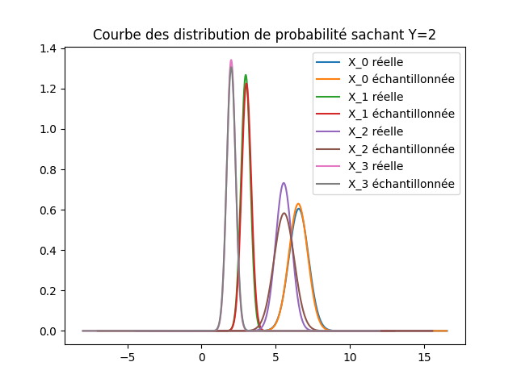

# Sampling

Une fois que les paramètres des classes sont obtenus en supposant l'indépendance des variables, on échantillone de nouvelles données afin de comparer les résultats obtenus avec les données d'origine.

  

L'échantillonage est fait dans le fichier `sampling.py`.

  

On fait 50 échantillons pour chaque classe, à partir des paramètres des distributions obtenus dans la section précédente.

  

On obtient les résultats suivants (la moyenne et l'écart-type sont donnés pour chaque classe et chaque variable):

---

# Résultats
## Naive Bayes
### Notre Naive Bayes

- Precision: 0.976

- Recall: 0.974

- Accuracy: 0.977

- F1 score: 0.975

### SKlearn Naive Bayes

- Precision: 0.976

- Recall: 0.974

- Accuracy: 0.977

- F1 score: 0.975

## Logistic Regression
### Notre Logistic Regression

- Precision: 0.850

- Recall: 0.846

- Accuracy: 0.866

- F1 score: 0.848

### SKlearn Logistic Regression
  

- Precision: 0.976

- Recall: 0.974

- Accuracy: 0.977

- F1 score: 0.975

---

# Conclusion
