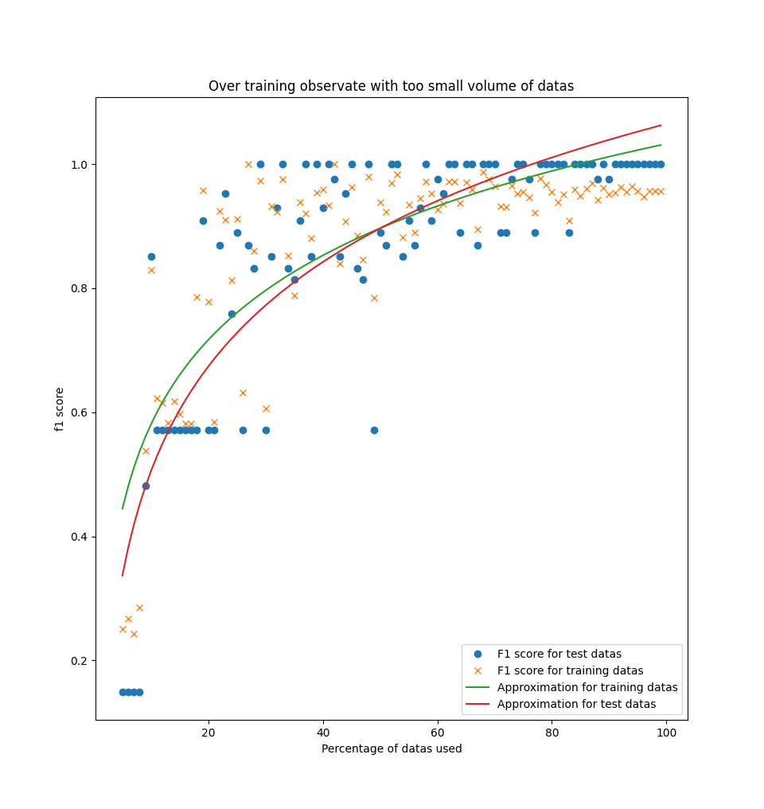
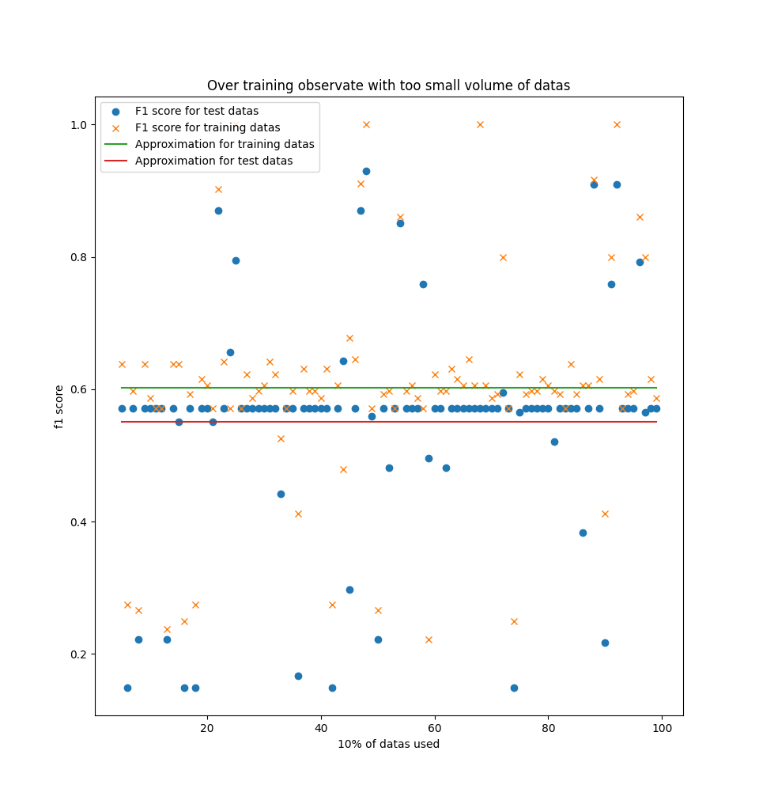
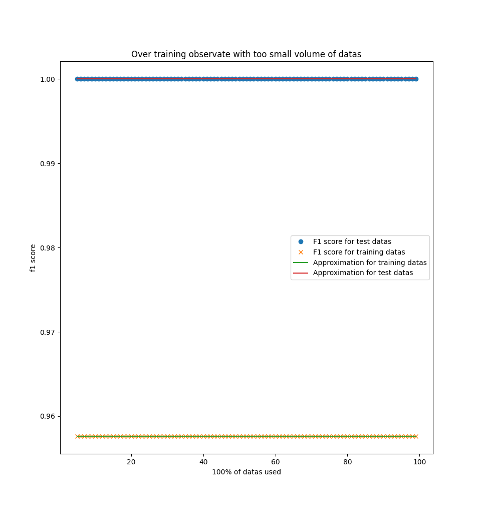

## 3.1 Phénomène de sur-apprentissage

Dans cette partie, nous allons voir les problèmes de sur-apprentissage du modèle de régression logistique multinomial.

Le phénomène de sur-apprentissage est lorsque le modèle entraîné s'adapte trop bien aux données d'apprentissage, donnant ainsi de moins bons résultats sur des données de test.
En effet, en s'adaptant trop aux données d'apprentissage, le modèle va s'entrainer aux données d'apprentissage, mais également au bruit de ces données.
Ce qui fait que le modèle ne pourra pas donner de bons résultats pour des données de test, car il aura été entraîné au bruit des données d'apprentissage.

Afin d'observer ce phénomène, on a décidé de faire varier le volume de données d'entrainement, et ensuite de regarder les performances du modèle sur les données d'entrainement et de test.

Lorsqu'on a peu de données, les résultats peuvent varier beaucoup.
Cela doit être dû à la prise aléatoire du bon pourcentage de données parmi les données d'entrainement.
Une approximation des résultats est donc faite, permettant de mieux visualiser ce qui se passe.

On a fait une approximation logarithmique de cette façon:

```python

a, b = np.polyfit(x, np.log(y), 1)
plt.plot(x, a * np.log(y) + b)
```

Ainsi, on obtient les résultats suivants:



On peut observer sur ce graphique que pour un volume trop petit de données, le modèle est trop entrainé pour les données d'entrainement.
En effet, on peut constater que les performances sont plus grandes pour les données d'entrainement, plutôt que pour les données de test.

Si on entraîne un modèle avec seulement 10% des données d'entrainement, on obtient le graphique suivant:



On peut observer que les performances sur les données d'entrainement sont plus grandes que sur les données de test.

Cependant, si on entraîne le modèle avec 100% des données d'entrainement, on obtient le graphique suivant:



On peut alors remarquer que les performances du modèle sont moins bonnes sur les données d'entraînement, plutôt que sur les données de test.
Le modèle n'a donc pas entraîné le bruit des données d'entrainement.

Donc si on n'a pas assez de données d'entrainement, les performances du modèle entraîné seront mauvaises, car celui-ci sera entraîné juste pour les données d'entrainement.

