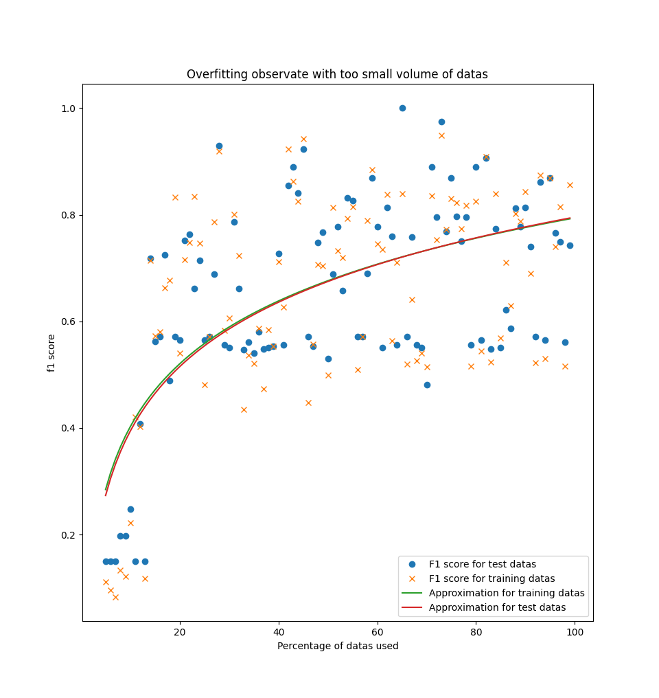

## 3.1 Phénomène de sur-apprentissage

Dans cette partie, nous allons voir les problèmes de sur-apprentissage du modèle de régression logistique multinomial.

Le phénomène de sur-apprentissage est lorsque le modèle entraîné s'adapte trop bien aux données d'apprentissage, si bien qu'il s'adapte au bruit des données d'apprentissage.
Cela a pour conséquences de produire de moins bonnes prédictions pour des données de test.
En effet, le modèle est "trompé" par le bruit des données d'apprentissage et prédira ainsi de mauvais résultats.

Dans l'énoncé, on nous propose d'utiliser un volume de données réduit afin de montrer le phénomène de sur-apprentissage.
Nous étions alors perplexe et nous nous posions cette simple question: pourquoi utiliser moins de données pour montrer le phénomène engendré lorsqu'on entraîne trop un modèle ?
À cette question, nous n'avons hélas pas encore trouvé de réponse qui tranche.
En effet, peut-être qu'il faut montrer qu'avec moins de données, le modèle entraîné peut avoir de bonnes performances sur les données d'apprentissage, mais pas sur les données de test.
Mais cela ne serait-il pas plutôt un phénomène de sous-apprentissage ?
Ou alors faut-il essayer d'entrainer un maximum notre paramètre $\theta$ sur les données d'apprentissage en espérant que notre modèle s'adaptera trop bien aux données d'apprentissage en donnant de mauvaises prédictions pour des données de test ?
Ou encore doit-on ajouter beaucoup de bruit dans les données d'apprentissage pour que le modèle s'entraine sur le bruit des données d'apprentissage et donne de moins bonnes prédictions pour des données de test ?
Bref, ne sachant pas trop quelle voie explorer, nous avons décidé d'en explorer plusieurs.

Tout d'abord, nous avons testé et entrainé les modèles pour un volume de données réduit.

Voici 2 graphes montrant les résultats obtenus avec la régression logistique multinomiale et l'approche naive bayes. Notez que nous avons tenté de faire une courbe approximant les données obtenues afin de mieux visualiser ce qu'il se passe.
Cette courbe est obtenue, en faisant un peu de bricolage, par le code suivant:
```python
a, b = np.polyfit(x, log(y), 1)
plt.plot(x, a * log(y) + b)
```
Ce qui est une sorte de régression linéaire "adaptée" pour une courbe logarithmique.

<center>

{width=67%}

{ width=67% }
<center/>
\newpage
Sur le graphique donné par Naive Bayes, nous pouvons constater que les f1 scores varient beaucoup, aussi bien pour les données d'entrainement que pour les données de test.
Cependant, on peut remarquer que pour un volume faible de données, la courbe verte, correspondant au f1 score obtenu avec les données d'entrainement, est légèrement au dessus de la courbe rouge, représentant le f1 score des données de test.
Cela signifie que lorsqu'on n'a pas assez de données d'entrainement, le modèle entrainé fera ne fera pas de bonnes prédictions sur les données de test, car celui-ci n'a pas été suffisamment entraîner pour bien ajuster ses paramètres: ses paramètres sont uniquement ajustés pour les données d'entrainement.

Cependant, nous pouvons constater que les f1 scores obtenus par Naive Bayes ne convergent pas...
C'est pourquoi, afin de montrer les phénomènes de sur-apprentissage, nous allons utiliser la régression logistique qui possède des f1 scores convergeant, comme nous pouvons l'observer sur le graphique.

Sur le graphique donné par la régression logistique, nous pouvons observer que les f1 scores sont très variés pour un volume faible de données, mais que ceux-ci convergent lorsque le volume de données augmente 
(On suppose que la même chose se produit avec Naive Bayes, mais qu'on n'a pas assez de données pour le remarquer...).
C'est pour cette raison que nous allons préférer utiliser la régression logistique plutôt que Naive Bayes pour montrer les phénomènes de sur-apprentissage.

Nous pouvons également constater que les performances sur les données d'entrainement sont meilleures que les performances sur les données de test.
Cela montre un "sur-ajustement" du modèle sur les données d'entrainement.
En effet, comme le volume de données est faible, les paramètres de la régression logistique sont bien entraînés pour les données d'entrainement, mais pas pour les données de test.

Cependant, lorsque le volume de données augmente, on voit que les paramètres de la régression logistique s'ajustent correctement, et on a des performances sur les données de test qui deviennent meilleures que les performances sur les données d'entrainement.

Donc plus on a des données, mieux on pourra ajuster notre modèle.
Dans notre cas, on ne peut pas tester ce que trop de données peuvent faire, car on n'a hélas pas un stock de données illimité.

Mais nous pouvons nous demander à quel point le bruit peut influencer la performance de notre modèle.

Afin d'éclaircir ce point, nous allons vous épargner la visualisation du graphique obtenu par Naive Bayes car celui-ci est très éparse: aucune donnée ne converge.
Mais nous allons vous montrer le graphique obtenu par la régression logistique.

Tout d'abord, pour ajouter du bruit aux données, nous indiquons un pourcentage des données qu'on veut bruiter.
Ensuite, nous prenons d'une manière aléatoire le pourcentage donné de données, et pour ces données sélectionnées, nous attribuons un label aléatoire parmi la liste de labels initiaux des données.
Cela entraine forcément qu'une donnée qu'on voulait bruiter a repris le même label qu'elle avait, et n'est donc pas bruité.
Donc le bruitage est approximatif.

Voici le graphique obtenu pour la régression logistique:


Nous pouvons constater que pour des données pas très bruitées, le modèle possède de bonnes performances.
Mais plus le bruit introduit dans les données augmente, plus on obtient des résultats éparpillés et décroissant dans l'ensemble.
Enfin, on peut observer pour 80 à 100% des données bruitées que le modèle possède de très mauvaises performances sur les données de test, qui sont moins bonnes que les performances obtenues sur les données d'entrainement.
Cela est causé par le bruit introduit dans les données: il y a suffisamment de bruit dans les données pour que le modèle soit entrainné au bruit des données d'apprentissage, ce qui cause de mauvaises performances sur des données de test.

Donc trop de bruit dans les données d'apprentissage d'un modèle peut rendre un modèle avec de mauvaises performances, car trop entrainé au bruit des données d'apprentissages.

Enfin, nous avons tenté de faire varier le nombre d'itérations lors de la descente en gradient de la régression logistique et ajouté du bruit aux données pour que les paramètres de la régression logistique soient perturbés par le bruit des données.
Nous avons mis 50% de bruit dans les données d'apprentissage, ce qui nous a donné le graphe suivant:


Les résultats nous plaisent car ils montrent que pour un faible nombre d'itérations, les performances du modèle sont bonnes, mais moins bonnes que pour un nombre moyen d'itérations, et pour un nombre trop grand d'itérations, les performances du modèle sont moins bonnes.

Cela signifie que si la descente en gradient est trop précise, on aura un modèle bien entrainé pour les données d'apprentissage, mais pas pour les données de test, car la performance du modèle sur les données de test diminue lorsqu'on a un nombre d'itérations élevé, tandis que la performance du modèle reste à peu près constante pour les données d'entrainement.

Ainsi, il faut également ajuster la précision de la descente en gradient afin d'obtenir non pas les paramètres optimaux pour les données d'apprentissage, mais pour obtenir des paramètres à la fois généraux et précis, permettant de donner des performances optimales sur des données de test.

Nous pouvons conclure que le sur-apprentissage ou sur-ajustement peut causer des problèmes dans les performances d'un modèle de classification, comme la régression logistique, car le modèle peut soit s'entrainer trop au bruit des données d'apprentissages, entrainant de mauvais résultats de test, soit ne pas avoir suffisamment de données d'apprentissage pour bien ajuster ses paramètres, soit trop s'entrainer aux données d'apprentissage, ce qui entraine une baisse de performance sur les données de tests, car le modèle est également entrainé au bruit des données d'apprentissage.

Enfin, il faut toujours s'assurer que le modèle donne les meilleures performances possibles sur les données de test, car les performances sur les données de test comptent plus que les performances sur les données d'apprentissage...
