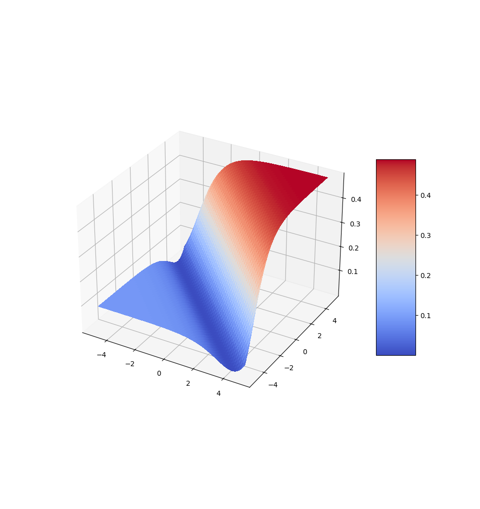
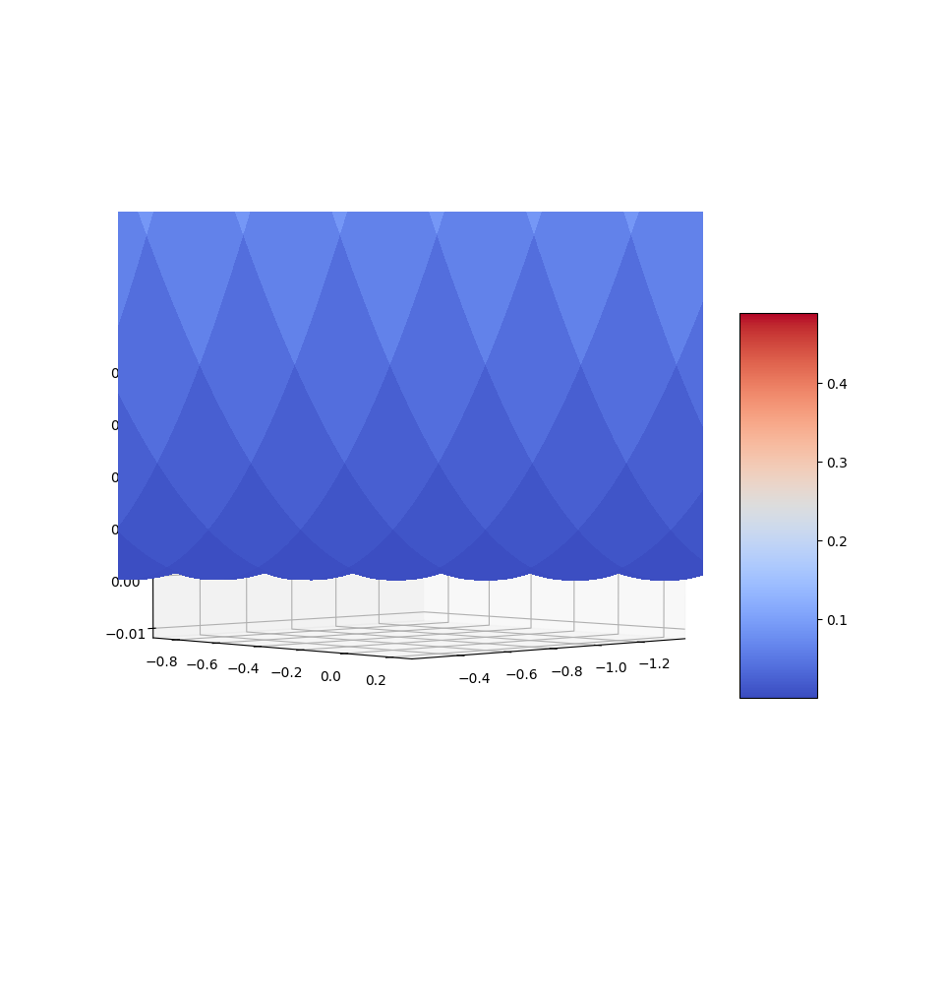

---
header-includes:
  - \usepackage{preamble_ai_project}
  - \usepackage[backend=bibtex,style=numeric]{biblatex} 
  - \bibliography{references}
output: pdf_document
colorlinks: true
urlcolor: Blue
linkcolor: Blue
---

\intro{}

# 1 -- Introduction \& Rappels théoriques

Dans ce document, nous approfondirons des techniques de regression logistique et "Naive Bayes" comme outils d'apprentissage superivisés.

Dans le cadre de l'intelligence artificielle et de l'apprentissage supervisé,
la compréhension et la classification précises des données revêtent une importance capitale. 
Parmi les diverses méthodologies existantes, la Régression Logistique et "Naive Bayes" 
se distinguent par leur efficacité et leur applicabilité dans de nombreux contextes.
Ce document se propose d'étudier ces deux techniques, en mettant l'accent sur leur mise en œuvre pratique, et leur efficacité comparative dans divers scénarios.

## 1.1 -- Régression Logistique

En statistiques, la régression logistique, s'inscrit dans le cadre des modèles de régression pour les variables binaires. 
Bien qu'elle soit quasiment exclusivement utilisée en tant que méthode de classification.  
En effet, c'est l'ajout d'un seuil, à la probabilité continue donnée par le model de regression qui nous permet de l'utiliser pour la classification.

Ce type de modèle vise à expliquer de manière optimale une variable binaire,
qui représente la présence ou l'absence d'une caractéristique spécifique,
à l'aide d'un ensemble conséquent de données réelles et d'un modèle mathématique.

Autrement dit, il s'agit de relier une variable aléatoire de Bernoulli,
généralement notée $y$, aussi appelé "label" à un vecteur constitué de plusieurs variables aléatoires, $(x_1, \ldots, x_K)$, aussi appelés "features". \cite{RegressionLogistique2023}.  

La régression logistique s'appuie sur un classifeur linéaire \cite{ClassifieurLineaire2022}
i.e. un classifieur dont la sortie (pour un vecteur de feature $x \in \R^n$) est donnée par:

$$
g(x) = f(\scalproduct{w}{x} + b)
$$
où $w \in \R^n$ est le vecteur de poids, $b \in \R$ le biais et $\scalproduct{.}{.}$ le produit scalair usuel.
$f$ est une fonction dite de seuillage qui va séparer nos résultats. Un choix commun pour $f$ est la sigmoide ou la fonction signe \cite{ClassifieurLineaire2022}.

Par exemple, dans le cas de la regression logistique binaire, on suppose le modèle suivant:

$$
y_i \sim Bernoulli(p_i),\quad p_i = \sigma(\scalproduct{w}{x_i} + b),\quad \sigma(z) = \frac{1}{1 + e^{-z}}
$$
où $x_i$ représente un vecteur (ligne) de $K$ valeurs pour les $K$ features (aussi appelé un *sample*), et $y_i$ la variable aléatoire qui représente le label qui leur est associé.

Cependant, dans notre dataset (voir \href{#choix-du-dataset-outils-utilisuxe9s}{section 2.0}) nous avons 3 classes (3 espèces d'iris),
$y$ ne suit donc, évidemment, plus une loi de Bernoulli.  
La sigmoide étant continue, nous avons simplement modifié la manière dont nous lui appliquions le seuillage, pour distinguer 3 cas au lieu de 2.
i.e. Au lieu de séparer le domaine en 2 ($\sigma(z) \leq 0.5,\ \sigma(z) > 0.5$), nous l'avons séparé en $N$ (ici $N = 3$).
On a donc que $y_i = k \Leftrightarrow \frac{k}{N} \leq \sigma(z) < \frac{k + 1}{N}$,
ce qui a donné des résultats plus que satisfaisants comme nous le verrons en \href{#ruxe9gression-logistique-1}{section 2.2}.

## 1.2 -- Naive Bayes

"Naive Bayes" se présente comme une méthode de classification probabiliste basée sur le [théorème de Bayes](https://en.wikipedia.org/wiki/Bayes%27_theorem), 
caractérisée par l'adoption d'une hypothèse d'indépendance forte entre les features (attributs), qualifiée de "naïve".  
Plus simplement, le classifieur est classifié de "naïf" car il part du principe que chaque feature (attribut) est indépendante des autres et a un poid égal quant à la probabilité qu'un point appartienne à une classe. 

Ce model est dit génératif contrairement à la regression logistique étant considéré comme "méthode discriminante" \cite{ClassifieurLineaire2022} et consiste à modéliser les probabilités conditionnelles $P(X | classe)$ pour chaque classe $y$ et vecteur de features $X$ afin de trouver celle qui maximise cette probabilité.

En d'autres termes, le problème revient à trouver, pour des attributs $X_1, \ldots, X_k$, la classe $\tilde{y}$ telle que:

$$
\tilde{y} = \text{arg}\max_{Y \in \mathcal{Y}} \left[\  P(Y) \prod_{k = 1}^K{P(X_k | Y)}\  \right]
$$

Citation Test: \cite{LinearModels}

# 2 -- Méthodologie  

## 2.0 -- Choix du dataset & outils utilisés

Pour la suite de ce projet les outils suivants ont été utilisés dans chaque parties:

- [python](https://www.python.org/)
- [numpy](https://numpy.org/)
- [pandas](https://pandas.pydata.org/)
- [sklearn](https://scikit-learn.org/stable/)
- [matplotlib](https://matplotlib.org/)
- [ucmilrepo](https://github.com/uci-ml-repo/ucimlrepo)
- [pytest](https://docs.pytest.org/en/stable/)

Le package `ucmilrepo` a été utilisé pour charger les données de notre dataset depuis la base de donnée du [UC Irvine Machine Learning Repository](https://archive.ics.uci.edu/ml/index).  

Le dataset que nous avons choisi est le fameux dataset "Iris" \cite{r.a.fisherIris1936}, un des plus anciens et connus dataset de classification. Il contient 150 observations de 3 espèces différentes d'iris (Iris setosa, Iris virginica et Iris versicolor) avec 4 features (longueur et largeur des sépales et pétales).  

Voici un aperçu des points-clés du dataset:

\begin{figure}
\centering
\includegraphics[width=0.8\textwidth,height=\textheight]{../res/iris_img.png}
\includegraphics[width=0.8\textwidth,height=\textheight]{../res/iris_table.png}
\caption{Iris descriptive table}
\end{figure}

Le label que nous allons prédire sera donc _class_, i.e. l'espèce de l'iris.

\newpage

## 2.1 -- Gradient Descent

Dans cette section, une implémentation de la "descente en gradient" a été réalisée. La fonction a la signature suivante 

\begin{lstlisting}
  def gradient_descent(df, params: NDArray, alpha: float, num_iters: int) -> NDArray:  
\end{lstlisting}

Elle calcule de manière itérative le(s) paramètre(s) \code{params} qui minimisent la fonction dont `df` est le gradient avec un "taux de convergence" \code{alpha}.

La fonction a été testé avec la fonction \code{scipy.optimize.fmin} \cite{ScipyOptimizeFmin} de la librairie `scipy` sur la fonction suivante: 
$$
f(x) = x * \cos(\pi  (x + 1))
$$

avec différents $x_0 \in \{-\pi, 0, \pi\}$ (valeur initiale de \code{params}, i.e. `NDArray` avec D=0).

Les minimas locaux trouvés par les deux fonctions sont les suivants:

{width=100%} 

Ce résultat illustre bien 2 choses: la première est que l'implémentation de la descente en gradient fonctionne correctement puisque pour chaque points trouvé par notre fonction est confondu avec celui trouvé par la fonction de scipy (c'est ce qui donne cette teinte "grise"). La deuxième est que la "qualité" du minima local (i.e. la distance avec le minima globale) 
dépend fortement de la valeur initiale et ce pour les deux fonctions.

\newpage{}

## 2.2 -- Régression Logistique

### 2.2.1 -- Fonction de coût pour la régression logistique

#### MSE -- Une mauvaise idée
:

Afin d'entraîner les paramètres de la régression logistique, il faut pouvoir comparer les résultats obtenus par la régression avec les résultats attendus.

Pour cela, on pourrait penser utiliser quelque chose comme la `Mean Squared Error (MSE)`, qui est une moyenne du carré de la différence entre le résultat obtenu par la régression (donné par $z$) et la valeur estimée $y$.

La MSE nous donne une estimation de l'erreur moyenne faite entre la fonction approximative $f$ et la valeur attendue $y$.

L'objectif est donc de minimiser la MSE afin de minimiser l'erreur entre les valeurs estimées et les valeurs attendues.

Ce qui nous donnerait
$$MSE = \frac{1}{n}\sum_i^n (\sigma(z_i) - y_i)^2$$

avec $\sigma$ la fonction sigmoïde utilisée pour la régression logistique, définie comme en section \href{#ruxe9gression-logistique}{1.1} notre MSE nous donnerait:

$$MSE = \frac{1}{n}\sum_i^n{\left(\frac{1}{1 + e^{-z_i}} - y_i \right)^2}$$

Afin de visualiser la MSE obtenue, nous avons créé un graph de la fonction
$$
\text{MSE}(w, b) = \frac{1}{n} \left( \frac{1}{1+ e^{w^T x + b}} - y_i \right)^2
$$
pour $x = 1$ et $y = 0.3$. Nous obtenons alors les graphes suivants:

Global vision | Zoomed vision
:------------:|:----------:
|
Fonction MSE avec $x = 1$ et $y = 0.3$ (global) | Fonction MSE avec $x = 1$ et $y = 0.3$ (zoomed)

Nous pouvons remarquer sur la figure zoomé, que la fonction admet plusieurs minimum locaux. La fonction MSE n'est donc pas convexe.
Ceci est problématique pour la descente en gradient, car celle-ci risquera de se retrouver coïncé dans un minimum local et ne trouvera jamais le minimum global.

Si on pouvait faire des plots pour la fonction avec plus de paramètres, on verrait mieux et plus de minimum locaux.

Cela est dû au fait que la fonction $\sigma(z)$ n'est pas linéaire. (Découle trivialement du fait qu'il y ait une exponentielle dans la fonction.)
Ce qui empêche la MSE d'être convexe.

La descente en gradient ne pourra donc pas fonctionnner correctement, car on pourrait trouver des minimum locaux à la place du minimum global, 
ce qui nous empêcherait de trouver les paramètres optimaux pour la régression logistique.

#### Log Loss -- Cross-Entropy
:

Pour résoudre ce problème, on utilise plutôt la `log loss` fonction, appellée également `cross-entropy`.

<!-- La formule de la `cross-entropy` est donnée par:
 $$H(p, q) = - \sum_{x \in \mathcal{X}} p(x) \log q(x)$$ 
qui n'est enfait riend d'autre que la forme développé de la formule-->

La formule de la log loss function est donnée par:
$$
\frac{1}{N} \sum_{i=0}^{N}{ \log p(y_i | x_i; w, b) }
$$ 

où l'on peut ensuite dévolpper $p(y_i | x_i; w, b)$ pour retomber sur la cross-entropy, avec $p(x) = y$ et $q(x) = z$

La fonction ci-dessus pénalise fortement (du moins plus que les autres cas) les fausses prédictions "confiantes" (i.e. annonce faux + haute probabilités) et son domaine d'arrivé est de 0 à $\infty$, un modèle parfait aurait une log-loss de 0.  
Un modèle complètement incorrect aurait, quant à lui, une log loss qui tend vers $\infty$

---

## 2.3 -- Naive Bayes

Dans cette section, une implémentation d'un classifieur linéaire bayesien (naive bayes) a été réalisée. 
La fonction de prédictition a la signature suivante:

\begin{lstlisting}
    #  TODO
\end{lstlisting}

et calcule la classe qui maximise la probabilité conditionnelle définie en section \href{#naive-bayes}{1.2}.

Dans cette implémentation, étant données que toutes nos features sont continues, nous avons considéré que _sepal length_, _sepal width_, _petal length_ et _petal width_ seront représenté comme 4 variables aléatoires $X_0, \cdots, X_3$ suivant 4 lois normales normales de paramètre $(\mu_k, \sigma_k)$.

C'est à dire:
$$
X_k \sim \mathcal{N}( \mu_k, \sigma_k) \qquad \qquad k \in \iitv{0, 3}
$$

\newpage{}

# 3 -- Résultats 

<!-- \newpage{} -->

\printbibliography[heading=bibintoc, title={Références}]

- TODO: ajouter les autres références des documentations utilisées

