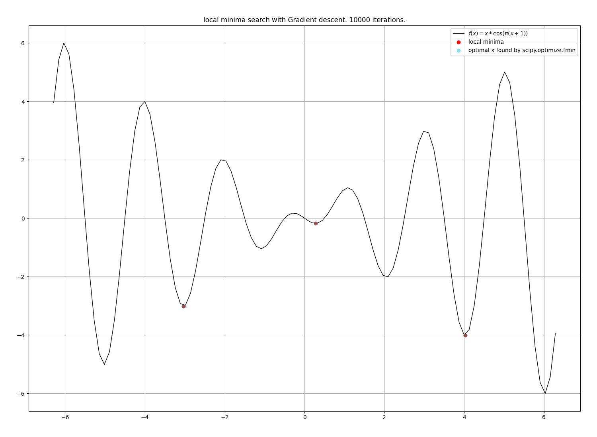

---
header-includes:
  - \usepackage{preamble_ai_project}
  - \usepackage[backend=bibtex,style=numeric]{biblatex} 
  - \bibliography{references}
output: pdf_document
colorlinks: true
urlcolor: Blue
linkcolor: Blue
---

\intro{}

# 1 -- Introduction

Dans ce document, nous approfondirons des techniques de regression logistique et "Naive Bayes" comme outils d'apprentissage superivisés.

Citation Test: \cite{LinearModels}

# 2 -- Méthodologie  

Pour la suite de ce projet les outils suivants ont été utilisés dans chaque parties:

- [python](https://www.python.org/)
- [numpy](https://numpy.org/)
- [sklearn](https://scikit-learn.org/stable/)
- [matplotlib](https://matplotlib.org/)

## 2.1 -- Gradient Descent

Dans cette section, une implémentation de la "descente en gradient" a été réalisée. la fonction a la signature suivante 

\begin{lstlisting}
  def gradient_descent(df, params: NDArray, alpha: float, num_iters: int) -> NDArray:  
\end{lstlisting}

Elle calcule de manière itérative le(s) paramètre(s) \code{params} qui minimisent la fonction dont `df` est le gradient avec un "taux de convergence" \code{alpha}.

La fonction a été testé avec la fonction \code{scipy.optimize.fmin} \cite{ScipyOptimizeFmin} de la librairie `scipy` sur la fonction suivante: 
$$
f(x) = x * \cos(\pi  (x + 1))
$$

avec différents $x_0 \in \{-\pi, 0, \pi\}$ (valeur initiale de \code{params}, i.e. `NDArray` avec D=0).

Les minimas locaux trouvés par les deux fonctions sont les suivants:

{width=71%} 

\newpage{}

Ce résultat illustre bien 2 choses: la première est que l'implémentation de la descente en gradient fonctionne correctement puisque pour chaque points trouvé par notre fonction est confondu avec celui trouvé par la fonction de scipy (c'est ce qui donne cette teinte "grise"). La deuxième est que la "qualité" du minima local (i.e. la distance avec le minima globale) 
dépend fortement de la valeur initiale et ce pour les deux fonctions.

# 3 -- Résultats 

<!-- \newpage{} -->

\printbibliography[heading=bibintoc, title={Références}]

- TODO: ajouter les autres références des documentations utilisées

