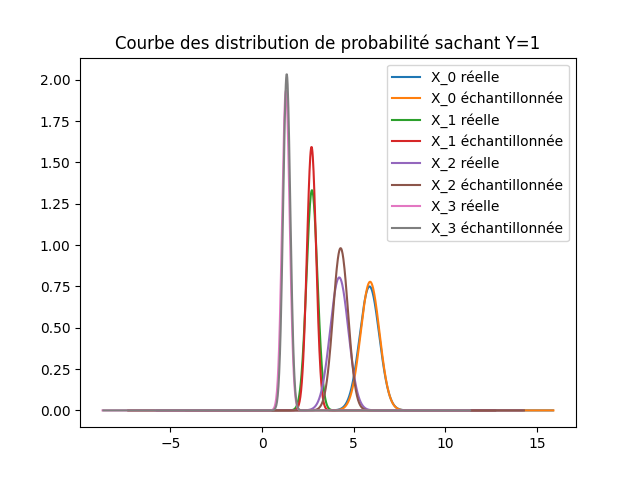
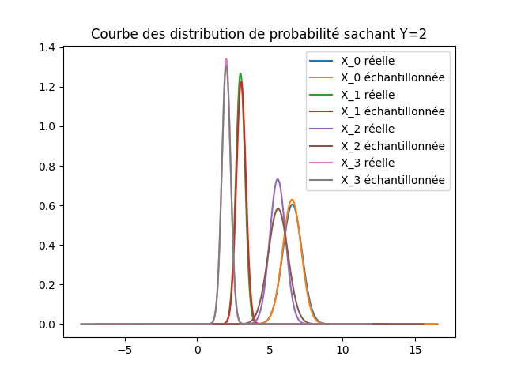

---
header-includes:
  - \usepackage{preamble_ai_project}
  - \usepackage[backend=bibtex,style=numeric]{biblatex} 
  - \bibliography{references}
  - \usepackage{algorithm}
  - \usepackage{algpseudocode}
  - \newcommand{\w}{\mathbf{w}}
  - \newcommand{\x}{\mathbf{x}}
output: pdf_document
colorlinks: true
urlcolor: Blue
linkcolor: Blue
---

\intro{}

# 1 -- Introduction \& Rappels théoriques

Dans ce document, nous approfondirons des techniques de regression logistique et "Naive Bayes" comme outils d'apprentissage superivisés.

Dans le cadre de l'intelligence artificielle et de l'apprentissage supervisé,
la compréhension et la classification précises des données revêtent une importance capitale. 
Parmi les diverses méthodologies existantes, la Régression Logistique et "Naive Bayes" 
se distinguent par leur efficacité et leur applicabilité dans de nombreux contextes.
Ce document se propose d'étudier ces deux techniques, en mettant l'accent sur leur mise en œuvre pratique, et leur efficacité comparative dans divers scénarios.


## 1.1 -- Régression Logistique

En statistiques, la régression logistique, s'inscrit dans le cadre des modèles de régression pour les variables binaires. 
Bien qu'elle soit quasiment exclusivement utilisée en tant que méthode de classification.  
En effet, c'est l'ajout d'un seuil, à la probabilité continue donnée par le model de regression qui nous permet de l'utiliser pour la classification.

Ce type de modèle vise à expliquer de manière optimale une variable binaire,
qui représente la présence ou l'absence d'une caractéristique spécifique,
à l'aide d'un ensemble conséquent de données réelles et d'un modèle mathématique.

Autrement dit, il s'agit de relier une variable aléatoire de Bernoulli,
généralement notée $y$, aussi appelé "label" à un vecteur constitué de plusieurs variables aléatoires, $(x_1, \ldots, x_K)$, aussi appelés "features". \cite{RegressionLogistique2023}.  

La régression logistique s'appuie sur un classifeur linéaire \cite{ClassifieurLineaire2022}
i.e. un classifieur dont la sortie (pour un vecteur de feature $x \in \R^n$) est donnée par:

$$
g(x) = f(\scalproduct{w}{x} + b)
$$
où $w \in \R^n$ est le vecteur de poids, $b \in \R$ le biais et $\scalproduct{.}{.}$ le produit scalair usuel.
$f$ est une fonction dite de seuillage qui va séparer nos résultats. Un choix commun pour $f$ est la sigmoide ou la fonction signe \cite{ClassifieurLineaire2022}.

Par exemple, dans le cas de la regression logistique binaire, on suppose le modèle suivant:

$$
y_i \sim Bernoulli(p_i),\quad p_i = \sigma(\scalproduct{\w}{\x_i} + b),\quad \sigma(z) = \frac{1}{1 + e^{-z}}
$$
où $\x_i \in \R^K$ représente un vecteur (ligne) de $K$ valeurs pour les $K$ features (aussi appelé un *sample*), et $y_i$ la variable aléatoire qui représente le label qui leur est associé.

Cependant, dans notre dataset (voir \href{#choix-du-dataset-outils-utilisuxe9s}{section 2.0}) nous avons 3 classes (3 espèces d'iris),
$y$ ne suit donc, évidemment, plus une loi de Bernoulli.  

__À modifier ?__
La sigmoide étant continue, nous avons simplement modifié la manière dont nous lui appliquions le seuillage, pour distinguer 3 cas au lieu de 2.
i.e. Au lieu de séparer le domaine en 2 ($\sigma(z) \leq 0.5,\ \sigma(z) > 0.5$), nous l'avons séparé en $N$ (ici $N = 3$).
On a donc que $y_i = k \Leftrightarrow \frac{k}{N} \leq \sigma(z) < \frac{k + 1}{N}$,
ce qui a donné des résultats plus que satisfaisants comme nous le verrons en \href{#ruxe9gression-logistique-1}{section 2.2}.


## 1.2 -- Naive Bayes

"Naive Bayes" se présente comme une méthode de classification probabiliste basée sur le [théorème de Bayes](https://en.wikipedia.org/wiki/Bayes%27_theorem), 
caractérisée par l'adoption d'une hypothèse d'indépendance forte entre les features (attributs), qualifiée de "naïve".  
Plus simplement, le classifieur est classifié de "naïf" car il part du principe que chaque feature (attribut) est indépendante des autres et a un poid égal quant à la probabilité qu'un point appartienne à une classe. 

Ce model est dit génératif contrairement à la regression logistique étant considéré comme "méthode discriminante" \cite{ClassifieurLineaire2022} et consiste à modéliser les probabilités conditionnelles $P(\x | classe)$ pour chaque classe $y$ et smaple $\x$ afin de trouver celle qui maximise cette probabilité.

En d'autres termes, le problème revient à trouver, pour des attributs $x_1, \ldots, x_k$, la classe $\tilde{y}$ telle que:

$$
\tilde{y} = \text{arg}\max_{y \in \mathcal{Y}} \left[\  P(y) \prod_{k = 1}^K{P(x_k | Y)}\  \right]
$$


# 2 -- Méthodologie  

## 2.0 -- Choix du dataset & outils utilisés

Pour la suite de ce projet les outils suivants ont été utilisés dans chaque parties:

- [python](https://www.python.org/)
- [poetry](https://python-poetry.org/)
- [Make](https://www.gnu.org/software/make/)
- [numpy](https://numpy.org/)
- [pandas](https://pandas.pydata.org/)
- [sklearn](https://scikit-learn.org/stable/)
- [matplotlib](https://matplotlib.org/)
- [ucmilrepo](https://github.com/uci-ml-repo/ucimlrepo)
- [pytest](https://docs.pytest.org/en/stable/)


Le package `ucmilrepo` a été utilisé pour charger les données de notre dataset depuis la base de donnée du [UC Irvine Machine Learning Repository](https://archive.ics.uci.edu/ml/index).  

Le dataset que nous avons choisi est le fameux dataset "Iris" \cite{r.a.fisherIris1936}, un des plus anciens et connus dataset de classification. Il contient 150 observations de 3 espèces différentes d'iris (Iris setosa, Iris virginica et Iris versicolor) avec $K = 4$ features (longueur et largeur des sépales et pétales).  

Voici un aperçu des points-clés du dataset:

\begin{figure}
\centering
\includegraphics[width=0.8\textwidth,height=\textheight]{../res/iris_img.png}
\includegraphics[width=0.8\textwidth,height=\textheight]{../res/iris_table.png}
\caption{Iris descriptive table}
\end{figure}

Le label que nous allons prédire sera donc _class_, i.e. l'espèce de l'iris.

\newpage


## 2.1 -- Gradient Descent

Dans cette section, une implémentation de la "descente en gradient" a été réalisée. La fonction a la signature suivante 

\begin{lstlisting}
  def gradient_descent(df, params: NDArray, alpha: float, num_iters: int) -> NDArray:  
\end{lstlisting}

Elle calcule de manière itérative le(s) paramètre(s) \code{params} qui minimisent la fonction dont `df` est le gradient avec un "taux de convergence" \code{alpha}.

La fonction a été testé avec la fonction \code{scipy.optimize.fmin} \cite{ScipyOptimizeFmin} de la librairie `scipy` sur la fonction suivante: 
$$
f(x) = x * \cos(\pi  (x + 1))
$$

avec différents $x_0 \in \{-\pi, 0, \pi\}$ (valeur initiale de \code{params}, i.e. `NDArray` avec D=0).

Les minimas locaux trouvés par les deux fonctions sont les suivants:

{width=100%} 


Ce résultat illustre bien 2 choses: la première est que l'implémentation de la descente en gradient fonctionne correctement puisque pour chaque points trouvé par notre fonction est confondu avec celui trouvé par la fonction de scipy (c'est ce qui donne cette teinte "grise"). La deuxième est que la "qualité" du minima local (i.e. la distance avec le minima globale) 
dépend fortement de la valeur initiale et ce pour les deux fonctions.

\newpage{}

## 2.2 -- Régression Logistique

### 2.2.1 -- Fonction de coût pour la régression logistique

Afin d'entraîner les paramètres de la régression logistique, il faut pouvoir comparer les résultats obtenus par la régression avec les résultats attendus.

On souhaite définir une fonction à minimiser permettant de trouver les paramètres optimaux de la régression logistique.

Notre classification se base sur la fonction sigmoïde $\sigma(z) = \frac{1}{1 + e^{-z}}$.

Comme la fonction exponnentielle est toujours positive, on a bien que $\sigma(z) \in [0, 1]$.

La fonction sigmoïde nous donne la probabilité que l'élément donné appartienne à un label.

Autrement dit, la fonction sigmoïde est la fonction de répartition de la régression logistique.

Soit $Y \in \{0, 1\}$ les différents labels que peut prendre l'élément que l'on considère et soit $X$ l'ensemble des caractéristiques connues de l'élément, dont on cherche à déterminer dans quelle classe le mettre, donc quel label on doit lui attribuer.
Soit $\theta$ le vecteur des poids des covariables, indiquant à quel point les covariables influencent sur la décision du label. On a donc:

$$P(Y = 1 | X) = \frac{1}{1 + e^{-(X_1 * w_1 + X_2*w_2 + \dots + b)}}$$
et 
$$P(Y = 0 | X) = 1 - \frac{1}{1 + e^{-(X_1 * w_1 + \dots + b)}}$$

Pour plus de simplicité, on va considérer que le biais est compris dans les poids: au lieu d'écrire $z = wX + b$, on écrit $z = \hat{X}\theta$ avec $\hat{X} = \begin{bmatrix} X & 1 \end{bmatrix}$ modifié ou on a ajouté une colonne avec que des $1$ à la fin de la matrice $X$ et $\theta = \begin{bmatrix} w & b \end{bmatrix}$ afin d'avoir une bonne cohérence avec le rapport et le code. (On a trouvé cela plus facile d'avoir pour chaque labels les poids et bias sur une ligne, donc d'avoir $\theta_1$ pour le label $1$ etc...)
Ainsi, on a:
$\hat{X} \theta^T = X_1 * w_1 + X_2 * w_2 + \dots + b$

Pour la suite, on va noter $X = \hat{X}$

<!-- \vspace{-3cm} -->

Notre régression logistique binaire peut donc s'écrire comme:
$$P(Y = 1 | X) = \frac{1}{1 + e^{X \theta^T}} = \sigma(X \theta^T)$$
et
$$P(Y = 0 | X) = 1 - \sigma(X \theta^T)$$

#### 2.2.1.1 -- Généralisation

On désire donc trouver une nouvelle distribution $\phi(z)$ tel que:
$$\phi(z) \in [0, 1]\ \forall z$$
est une généralisation de la fonction $\sigma(z)$

On veut donc que pour une régression logistique binaire, on ait $\sigma(z) = \phi(z)$.

On peut remarquer que:

$$P(Y = 1 | X)$$
$$=\frac{1}{1 + e^{-X \theta^T}}$$
$$=\frac{1}{1 + e^{-X \theta^T}} * \frac{e^{X \theta^T}}{e^{X \theta^T}}$$
$$=\frac{e^{X \theta^T}}{e^{X \theta^T} + e^{X \theta^T - X \theta^T}}$$
$$=\frac{e^{X \theta^T}}{e^{X \theta^T} + e^0}$$
$$=\frac{e^{X \theta^T}}{e^{X \theta^T} + 1}$$

On peut considérer que nous avons un vecteur de poids pour chaque label.

Ainsi, on a $\theta_0 = \begin{bmatrix} w_0 & b_0 \end{bmatrix}$ pour le label 0 et $\theta_1 = \begin{bmatrix} w_0 & b_0 \end{bmatrix}$ pour le label 1.

Comme on a besoin seulement d'un vecteur de poids pour déterminer le label de nouveaux éléments avec leurs caractéristiques, on peut considérer que $\theta_0 = \begin{bmatrix} 0 & \dots & 0 \end{bmatrix}$.

Ainsi, la formule précédente nous donne:

$$P(Y = 1 | X)$$
$$=\frac{e^{X \theta_1^T}}{e^{X \theta_1^T} + 1}$$
$$=\frac{e^{X \theta_1^T}}{e^{X \theta_1^T} + e^0}$$
$$=\frac{e^{X \theta_1^T}}{e^{X \theta_1^T} + e^{0 * X}}$$
$$=\frac{e^{X \theta_1^T}}{e^{X \theta_1^T} + e^{X \theta_0^T}}$$
$$=\frac{e^{X \theta_1^T}}{\sum_{i = 0}^1 e^{X \theta_i^T}}$$

On peut donc généraliser cette formule pour $K$ labels.

Cela nous donne:

$$P(Y = k| X )=\frac{e^{X \theta_k^T}}{\sum_{i = 0}^K e^{X \theta_i^T}}$$

Comme la fonction exponentielle est toujours positive, on a bien que:
$$0 \leq e^{X \theta_k^T} \leq e^{X \theta_k^T} + \sum_{i \neq k}^K e^{X \theta_i^T}$$
$$\Leftrightarrow 0 \leq e^{X \theta_k^T} \leq \sum_{i}^K e^{X \theta_i^T}$$
$$\Leftrightarrow 0 \leq \frac{e^{X \theta_k^T}}{\sum_{i}^K e^{X \theta_i^T}} \leq 1$$
$$\Leftrightarrow 0 \leq \phi(z) \leq 1$$

De plus, on a que:
$$\sum_k^K P(Y = k | X)$$
$$=\sum_k^K \frac{e^{X \theta_k^T}}{\sum_i^K e^{X \theta_i^T}}$$
$$=\frac{\sum_k^Ke^{X \theta_k^T}}{\sum_i^K e^{X \theta_i^T}}$$
$$=\frac{\sum_i^Ke^{X \theta_i^T}}{\sum_i^K e^{X \theta_i^T}}$$
$$=1$$

Donc la fonction $\phi(z)$ est bien une fonction de distribution de probabilité qui généralise la fonction sigmoïde pour des problèmes à plusieurs labels.

Cette fonction est courramment appelée fonction `softmax`.

#### 2.2.1.2 -- Fonction de coût

Notre objectif est donc de trouver une fonction de coût pour pouvoir entraîner les paramètres de la régression multinomiale.
On cherche à maximiser la vraisemblance des données.
Donc pour un label $Y$ donné, on veut maximiser:
$$\sum_k^K f(Y, k) P(Y = k | X)$$
avec $f(Y, k)$ la fonction qui vaut $1$ si $Y = k$ et $0$ sinon.

Comme on a plusieurs couples de données $(X_i, Y_i)$, on peut écrire la fonction précédente comme:

$$\sum_i^n\sum_k^K f(Y_i, k) P(Y_i = k | X_i)$$

En maximisant cette fonction, on fait en sorte que le paramètre $\theta_k$ permette d'obtenir la prédiction que le label soit égal à $k$ avec la somme des probabilités où $Y_i = k$ est la plus grande possible.

Afin de pouvoir utiliser un algorithme comme la descente en gradient, il faut non pas maximiser une fonction, mais minimiser une fonction.

Tout d'abord, comme on travaille avec des exponentielles, on a intérêt à prendre un logarithme pour éviter d'avoir à travailler avec de trop grandes valeurs. Cette modification n'aura pas d'impact sur la convexité car la fonction logarithme est une fonction strictement croissante.

Enfin, comme on cherche une fonction à minimiser et non pas à maximiser pour pouvoir utiliser la descente en gradient, on va prendre l'inverse de la fonction.

Cela s'appelle courrament le `negative logarithm likelihood`.

Cela nous donne une fonction de coût comme suit:

$$\sum_i^n \sum_k^K f(Y_i, k) \log(\frac{1}{P(Y_i = k | X_i)})$$
$$\sum_i^n \sum_k^K f(Y_i, k) (\log(1) - \log(P(Y_i = k | X_i)))$$
$$-\sum_i^n \sum_k^K f(Y, k)\log(P(Y_i = k | X_i))$$

On peut minimiser cette fonction de coût grâce à une descente en gradient.

#### 2.2.1.3 -- Dérivée de la fonction de coût

On va calculer la dérivée de la fonction de coût.

On a:

$$log(P(Y = k | X))$$
$$=log\left(\frac{e^{X \theta_k^T}}{\sum_i^K e^{X\theta_i^T}}\right)$$
$$=X \theta_k^T - log\left(\sum_i^K e^{X \theta_i^T}\right)$$

Donc:
$$\frac{\partial}{\partial \theta_{j}} \sum_i^K f(Y, i)log(P(Y = i | X))$$
$$\text{(NB: On considère que Y = k, tous les autres termes étant annulés car f = 0)}$$
$$=\frac{\partial}{\partial \theta_{j}} f(Y, k)log(P(Y = k | X))$$
$$=\frac{\partial}{\partial \theta_{j}} \left(X \theta_{k}^T - log\left(\sum_i^K e^{X \theta_i^T}\right)\right) $$
Supposons que j = k.
$$=X - \frac{\partial}{\partial \theta_{j}}log\left(\sum_i^K e^{X \theta_i^T}\right) $$
$$=X - \frac{1}{\sum_i^K e^{X \theta_i^T}} \frac{\partial}{\partial \theta_{j}}\sum_i^K e^{X \theta_i^T} $$
$$=X - \frac{1}{\sum_i^K e^{X \theta_i^T}} \frac{\partial}{\partial \theta_{j}}e^{X \theta_j^T}$$
$$=X - \frac{X e^{X \theta_j^T}}{\sum_i^K e^{X \theta_i^T}}$$
$$=X - X P(Y = j | X)$$
$$=X (1 - P(Y = j | X))$$
Supposons que $j \neq k$.

$$\frac{\partial}{\partial \theta_{j}} \left(X \theta_{k}^T - log\left(\sum_i^K e^{X \theta_i^T}\right)\right) $$
$$= - \frac{\partial}{\partial \theta_{j}}log\left(\sum_i^K e^{X \theta_i^T}\right) $$
$$= - \frac{1}{\sum_i^K e^{X \theta_i^T}} \frac{\partial}{\partial \theta_{j}}\sum_i^K e^{X \theta_i^T} $$
$$= - \frac{1}{\sum_i^K e^{X \theta_i^T}} \frac{\partial}{\partial \theta_{j}}e^{X \theta_j^T} $$
$$= - \frac{Xe^{X \theta_j^T}}{\sum_i^K e^{X \theta_i^T}} $$
$$= -X P(Y = j | X)$$

On a donc:
$$\frac{\partial}{\partial \theta_{j}} \sum_i^K f(Y, i)log(P(Y = i | X)) = X(f(Y, j) - P(Y = j|X))$$

car $f(Y, k)$ est égal à 1 si $Y = k$ et 0 sinon.

Donc pour $n$ données, cela nous donne:
$$\frac{\partial}{\partial \theta_{j}} \sum_m^n \sum_i^K f(Y_m, i)log(P(Y_m = i | X_m)) = \sum_m^n X_m(f(Y_m, j) - P(Y_m = j|X_m))$$

Maintenant, on est prêt pour entraîner notre régression logistique multinomiale !

### 2.2.2 -- Apprentissage

Maitenant que nous avons une fonction de coût permettant de quantifier (en moyenne) à quel point un set de $N$ prédiction est correct/incorrect à un point de l'apprentissage donné.
Il ne reste plus qu'à chercher les paramètres optimaux qui minimisent cette fonction de coût.
Ce que l'on va réaliser à l'aide de la descente en gradient. C'est le processus d'apprentissage.

En effet, lors de l'apprentissage, on va chercher de manière itérative les $\w$ et $b$ qui respectent les critères mentionnés ci-dessus en calculant le gradient de la fonction de coût à chaque itérations et en allant dans la direction opposé.


Concrètement cela revient à appliquer l'algorithme suivant:

\begin{algorithm}
\caption{gradient descent}\label{alg:grad_desc}
\begin{algorithmic}
\Function {GradientDescent}{$f, \w_{init}, b_0, \alpha, \text{num\_iters}$}
\State $\w \gets \w_{init}$
\State $b \gets b_0$
\For{1 to num\_iters}
    \State $\mathbf{dw}, db \gets \nabla{f(w, b)} $
    \State $\w \gets \w - \alpha*\mathbf{dw}$
    \State $b \gets b - \alpha*db$
\EndFor
\State \Return $w, b$
\EndFunction
\end{algorithmic}
\end{algorithm}

En pratique, il est plus simple de passer directement la function qui calcul le gradient en argument, que d'essayer de le calculer dynamiquement, c'est pourquoi la signature de notre implémentation prend un `df` en argument plutôt que la fonction de coût elle même.  
Où le calcul des dérivées partielles a été definit comme ci-dessous.


Soit $\nabla C(\w,b) = (\frac{\partial C(\w,b)}{\partial \w}, \frac{\partial C(\w,b)}{\partial b} )$, pour un sample $\x_i$ et sa classe $y_i$, on obtient:
\begin{align*}
\frac{\partial \log(y_i|\x_i ; \w, b)}{\partial b} 
&= y_i - \sigma(z_i) 
= y_i - \sigma(\w^T X_i + b)\\
%
\frac{\partial \log(y_i|\x_i ; \w, b)}{\partial w_j} 
&= x_{ij}* ( y_i - \sigma(z_i)) 
= (y_i - \sigma(\w^T X_i + b)) * x_{ij}
\end{align*}
Or le `db` dans l'algorithme ci-dessus se refert à la moyenne (pour tout i) de ces valeurs (i.e. distance moyenne _classes prédites_ -- _"vrai" classes_).

On l'obtient donc comme suit: (la somme des dérivées est la dérivée de la somme, linéarité de la dérivée)
$$\nabla_b\, {C} =\frac{1}{N} \sum_{i = 1}^{N}{ \frac{\partial \log(y_i|\x_i ; \w, b)}{\partial b} =  \frac{1}{N} \sum_{i=1}^N{y_i - \sigma(\w^T X_i + b)}}$$

De même pour `dw`:
\begin{align*}
  \nabla_{\mathbf{w}} C & = \frac{1}{N} \sum_{i = 1}^{N}(x_{ij}(y_i - p_i))_{1 \leq j \leq k} 
  = \frac{1}{N} \sum_{i=1}^N(y_i - \sigma(z_i))\cdot (x_{ij})_{1 \leq j\leq k} \\
%
& =\frac{1}{N}\sum_{i = 1}^N (y_i - \sigma(\mathbf{w}^T\mathbf{x_i} + b))\ \mathbf{x_i}
\end{align*}


On retrouve ainsi, le calcul effectué dans la fonction \code{grad} de \code{log\_reg.py} de signature suivante: 

\begin{lstlisting}
    def grad(X: NDArray, y: NDArray, w: NDArray, b: float) -> tuple:
\end{lstlisting}

Etant donné que pour le calcul du gradient il est nécessaire d'avoir un matrice de feature $X$ et vecteur de label $y$, une version "modifiée" de la descente en gradient a été implementé.

\begin{lstlisting}
def grad_desc_ml(features: NDArray, labels: NDArray, df, w: NDArray, b: float, alpha: float, num_iters: int) -> tuple[NDArray, float]:
\end{lstlisting}

Cette fonction se comporte exactement de la même manière que celle décrite en \href{#gradient-descent}{section 2.1}. La seule différence est qu'elle passe `features` et `labels` comme `X` et `y` à la fonction `df` (dans notre cas `df` est toujours la fonction `grad`), i.e. on a \code{df(features, labels, w, b)} au lieu de \code{df(params)}.

### 2.2.3 -- Prédictions

Pour la prédiction, nous avons utilisé la fonction suivante:

\begin{lstlisting}
   def predict_log_reg(X: NDArray, w: NDArray, b):
\end{lstlisting}

qui prend simplement $\sigma(w^T X + b)$ et seuil la sortie du sigmoide de manière à retourner un nombre entre 0 et 2 (avec les poids et bais entraînés). 

\newpage{}

### 2.2.4 -- Résultats

Suite à l'apprentissage , nous avons obtenu les résultats suivants:
\begin{align*}
    w &= [0.53452349, 0.36463584, 1.16132476, 1.08204578]\\
    b &= 0.45146791
\end{align*}

> N.B.:   
L'apprentissage peut être ré-effectué de manière efficient si besoine est à l'aide du jupyter notebook [training\_test.ipynb](https://github.com/David-Kyrat/13X005-AI-Project/blob/gpu-training/training_test.ipynb) disponible sur la branche [gpu-training](https://github.com/David-Kyrat/13X005-AI-Project/blob/gpu-training/training_test.ipynb) du repository github.
Le code de l'entraînement (uniquement sur cette branche) à été "porté" sur cuda / gpgpu à l'aide de la librairie [cupy](https://cupy.dev) \cite{NumPySciPyGPU}.  
A noter qu'il utilise des fonctions des sklearn alors que nous devions les implémenter nous mêmes, (telles que les metrics f1-score...).
Ces fonctions ont bien été implenté mais pour une raison de simplicité, elle n'ont pas été utilisée pour l'entrainement. Le code de cette branche ne fera donc pas partie du rendu mais reste publiquement accessible sur github.  

\vspace{0.3cm}

Comme dit en section 1.1, ces paramètres sont, en effet, plus que satisfaisants,
comme on peut le voir sur l'output de `pytest` suivant:

\begin{lstlisting}
src/log_reg.py::test_log_reg_f1score 
weights & biases: [0.53452349, 0.36463584, 1.16132476, 1.08204578], 0.45146791  
{ 'accuracy': 1.0, 'f1_score': 1.0, 'precision': 1.0, 'recall': 1.0 }
PASSED

src/naive_bayes.py::test_predict_bayes_f1score_all  
{ 'accuracy': 0.97, 'f1_score': 0.975, 'precision': 0.976, 'recall': 0.974 }
PASSED
\end{lstlisting}

NB: pour reproduire cette output, lancer \code{make test\_model}.

Ce résultat a été obtenu avec une séparation 70/30 de training/test data. 
Lorsque l'on essaye de changer la portion qui est prise aléatoirement dans chaque catégorie, 
on obtient un F1-score qui varie entre 0.93 et 1.0 (avec, dans de rares exceptions 0.91 ou 0.89).

De plus, l'on voit que les performances que nous avons obtenus rentrent tout à fait dans le cadre de celles annoncées par le UCI ML Repository:

{width=70%}

Ce résultat illustre bien que notre démarche est correcte et que nos 2 modèles sont efficaces, avec un penchant pour la régression logistique qui semble être plus efficace que Naive Bayes.


<!-- --- -->

\newpage{}

## 2.3 -- Naive Bayes

Dans cette section, une implémentation d'un classifieur linéaire bayesien (naive bayes) a été réalisée. 

### 2.3.1 -- Extraction des distributions

Dans cette implémentation, étant données que toutes nos features sont continues, nous avons considéré que _sepal length_, _sepal width_, _petal length_ et _petal width_ seront représenté comme 4 variables aléatoires $X_0, \cdots, X_3$ suivant 4 lois normales normales de paramètre $(\mu_k, \sigma_k)$.

C'est à dire:
$$
X_k \sim \mathcal{N}( \mu_k, \sigma_k) \qquad \qquad k \in \iitv{0, 3}
$$

Elles peuvent être récupérées à l'aide de la fonction suivante:

\begin{lstlisting}
def get_distrib_parameters(features: DataFrame, labels) -> dict[Any, list[tuple[fl, fl]]]:
\end{lstlisting}

qui va retourner un dict mappant chaque classe à une liste contenant les paramètres des distributions conditionnelles (normales) des features pour cette classe.


### 2.3.2 -- Prédictions

Deux fonctions de prédictions ont été implémenté,

1. Prennant un sample et prédisant sa classe
2. Une deuxième qui prend tous les samples et applique, en parallèle, la première fonction à chacun d'eux.

Elles ont les signatures suivantes:

\begin{lstlisting}
    def predict_bayes(x, params_by_class: dict[Any, list[tuple[fl, fl]]]) -> Any:
    def predict_bayes_all(X: DataFrame, params_by_class: dict[Any, list[tuple[fl, fl]]] | None = None) -> list[Any]:
\end{lstlisting}

Comme dit précédemment, pour pouvoir prédire la classe d'un sample, il faut calculer les probabilité conditionnelle $P(\x | classe)$
pour chaque classe $y$ et sample $\x$ et prendre la classe qui maximise cette dernière.

Cela revient à chercher le $\tilde{y}$ défini en \href{#naive-bayes}{section 1.2}, 
développons le calcul qui nous amené à cette formule:

$$
\tilde{y}  = \text{arg}\max_{y \in \mathcal{Y}}\ P(y|\x) = \text{arg}\max_{y \in \mathcal{Y}}\ \frac{P(\x|y)  P(y)}{P(\x)} =  \text{arg}\max_{y \in \mathcal{Y}}\ P(\x | y)P(y)
$$

Or
$$ 
P(\x | y) = P(x_1 | y) \prod_{i = 2}^{n}{P(x_i | x_{i-1}, \ldots, x_1, y)}
$$
Avec l'hypothèse que les $\{X_i\}_{i \leq n}$ sont indépendants, on obtient que: 

$$P(x_i | x_{i-1}, \ldots, x_1, y) = P(x_i | y)$$

Donc
$$P(\x|y) = P(x_1 | y) \prod_{k = 2}^{K}{P(x_k | y)} = \prod_{k=1}^K{P(x_k | y)}$$

En conclusion:
$$ \tilde{y} = \text{arg}\max_{y \in \mathcal{Y}} \left[\  P(y) \prod_{k = 1}^K{P(x_k | y)}\  \right] $$ 
(où $K$ reste le nombre de features.)

Où au début on cherche à maximiser $P(y | x)$ car idéalement on voudrait savoir la probabilité que $y$ soit le bon label pour n'importe quel sample $\x$. 
Cependant, on aimerait pouvoir effectuer cette prédictions pour des $\x$ 
qui n'appartiennent pas à notre dataset d'apprentissage, i.e. on ne doit pas avoir besoin
d'avoir déjà vu exactement ce sample. On a donc besoin d'une généralisation, c'est ainsi que l'on fini par retomber sur
 
$$ \tilde{y} = \text{arg}\max_{y \in \mathcal{Y}} \left[\  P(y) \prod_{k = 1}^K{P(x_k | y)}\  \right] $$ 

qui est ce que calculent les fonctions dont on a donné la signature ci-dessus.

### 2.3.3 -- Résultats

Dans cette section, nous allons simplement reprendre ce qui a été fait dit dans la 
\href{#ruxe9sultats}{section 2.2.4} et remontrer les mêmes tests.

Voici l'output du test `pytest` pour les rapports de performances du model bayesien:

\begin{lstlisting}
src/log_reg.py::test_log_reg_f1score 
weights & biases: [0.53452349, 0.36463584, 1.16132476, 1.08204578], 0.45146791  
{ 'accuracy': 1.0, 'f1_score': 1.0, 'precision': 1.0, 'recall': 1.0 }
PASSED

src/naive_bayes.py::test_predict_bayes_f1score_all  
{ 'accuracy': 0.97, 'f1_score': 0.975, 'precision': 0.976, 'recall': 0.974 }
PASSED
\end{lstlisting}

Ce résultat a été obtenu avec une séparation 70/30 de training/test data.  
Ces résultats illustrent bien que notre démarche est correcte et que nos 2 modèles sont efficaces, avec un penchant pour la régression logistique qui semble être plus efficace que Naive Bayes.  
Cependant, un f1-score de $> 0.95$ reste excellent.

\newpage{}

# 3. -- Analyse

Pour chaque classe y, on peut tracer les fonctions de distribution de probabilité pour chaque donnée $X_k$ sachant la classe y afin d'analyser la structure des données. 

Pour la classe Y=0, on obtient le graphe suivant :


On peut voir tout d'abord que pour cette classe, les pics des courbes bleue et rouge sont bien inférieurs aux pics des courbes vert et magenta. Ainsi, on en conclu que les variables $X_0$ et $X_1$ ont moins d'influence dans la prédiction de cette classe. Alors que le pic de la courbe magenta est bien supérieur aux autres, indiquant que la variable $X_3$ a une forte influence sur la prédiction de cette classe. De plus, on observe que seul les courbent bleu et rouge ont un chevauchement perceptible mais quand même assez petit, on en conclu que les variables sont pour cette classe très peu indépendante les unes des autres. 

\newpage{}

Pour la classe Y=1, on obtient le graphe suivant :


On peut voir tout d'abord que pour cette classe, les pics des courbes bleus et verte sont bien inférieurs aux pics des courbes rouge et magenta. Ainsi, on en conclu que les variables $X_0$ et $X_2$ ont moins d'influence dans la prédiction de cette classe. Alors que le pic de la courbe magenta est bien supérieur aux autres, indiquant que la variable $X_3$ a une forte influence sur la prédiction de cette classe. De plus, on observe que les courbes rouge et magenta ont un faible chevauchement indiquant une faible interdépence entre $X_3$ et $X_1$ alors que les courbes rouge et verte ainsi que verte et bleue ont un chevauchement assez élevé montrant une certaine interdépendance entre les variables $X_1$ et $X_2$ ainsi qu'entre les variables $X_0$ et $X_2$.

\newpage{}

Enfin pour la classe Y=2, on obtient le graphe suivant :


On observe que les pics des courbes rouge et magenta sont presque deux fois plus grand que ceux des courbes bleue et verte, de plus les courbes rouge  se chevauchent fortement. Ainsi les variables $X_3$ et $X_1$ ont une très forte influence sur cette classe et sont assez interdépendant alors que les variables $X_0$ et $X_2$ ont très peu d'impacte sur la prédiction de cette classe. Les courbes bleue et verte se chevauchent aussi énormément montrant aussi une forte interdépendance entre les variables $X_0$ et $X_2$. 


Ainsi on peut remarquer que globalement la variable $X_3$ a une forte influence sur la classification alors que la variable $X_0$ a une plus faible. 
De plus, les variables indépendantes ne sont pas séparables les unes des autres.  

## 3.1 -- Phénomène de sur-apprentissage

Dans cette partie, nous allons voir les problèmes de sur-apprentissage du modèle de régression logistique multinomial.

Le phénomène de sur-apprentissage est lorsque le modèle entraîné s'adapte trop bien aux données d'apprentissage, si bien qu'il s'adapte au bruit des données d'apprentissage.
Cela a pour conséquences de produire de moins bonnes prédictions pour des données de test.
En effet, le modèle est "trompé" par le bruit des données d'apprentissage et prédira ainsi de mauvais résultats.

Dans l'énoncé, on nous propose d'utiliser un volume de données réduit afin de montrer le phénomène de sur-apprentissage.
Nous étions alors perplexe et nous nous posions cette simple question: pourquoi utiliser moins de données pour montrer le phénomène engendré lorsqu'on entraîne trop un modèle ?
À cette question, nous n'avons hélas pas encore trouvé de réponse qui tranche.
En effet, peut-être qu'il faut montrer qu'avec moins de données, le modèle entraîné peut avoir de bonnes performances sur les données d'apprentissage, mais pas sur les données de test.
Mais cela ne serait-il pas plutôt un phénomène de sous-apprentissage ?
Ou alors faut-il essayer d'entrainer un maximum notre paramètre $\theta$ sur les données d'apprentissage en espérant que notre modèle s'adaptera trop bien aux données d'apprentissage en donnant de mauvaises prédictions pour des données de test ?
Ou encore doit-on ajouter beaucoup de bruit dans les données d'apprentissage pour que le modèle s'entraine sur le bruit des données d'apprentissage et donne de moins bonnes prédictions pour des données de test ?
Bref, ne sachant pas trop quelle voie explorer, nous avons décidé d'en explorer plusieurs.

Tout d'abord, nous avons testé et entrainé les modèles pour un volume de données réduit.

Voici 2 graphes montrant les résultats obtenus avec la régression logistique multinomiale et l'approche naive bayes. Notez que nous avons tenté de faire une courbe approximant les données obtenues afin de mieux visualiser ce qu'il se passe.
Cette courbe est obtenue, en faisant un peu de bricolage, par le code suivant:
```python
a, b = np.polyfit(x, log(y), 1)
plt.plot(x, a * log(y) + b)
```
Ce qui est une sorte de régression linéaire "adaptée" pour une courbe logarithmique.


{width=67%}

\newpage

Sur le graphique donné par Naive Bayes, nous pouvons constater que les f1 scores varient beaucoup, aussi bien pour les données d'entrainement que pour les données de test.
Cependant, on peut remarquer que pour un volume faible de données, la courbe verte, correspondant au f1 score obtenu avec les données d'entrainement, est légèrement au dessus de la courbe rouge, représentant le f1 score des données de test.
Cela signifie que lorsqu'on n'a pas assez de données d'entrainement, le modèle entrainé fera ne fera pas de bonnes prédictions sur les données de test, car celui-ci n'a pas été suffisamment entraîner pour bien ajuster ses paramètres: ses paramètres sont uniquement ajustés pour les données d'entrainement.

Cependant, nous pouvons constater que les f1 scores obtenus par Naive Bayes ne convergent pas...
C'est pourquoi, afin de montrer les phénomènes de sur-apprentissage, nous allons utiliser la régression logistique qui possède des f1 scores convergeant, comme nous pouvons l'observer sur le graphique.

{ width=67% }

Sur le graphique donné par la régression logistique, nous pouvons observer que les f1 scores sont très variés pour un volume faible de données, mais que ceux-ci convergent lorsque le volume de données augmente 
(On suppose que la même chose se produit avec Naive Bayes, mais qu'on n'a pas assez de données pour le remarquer...).
C'est pour cette raison que nous allons préférer utiliser la régression logistique plutôt que Naive Bayes pour montrer les phénomènes de sur-apprentissage.

Nous pouvons également constater que les performances sur les données d'entrainement sont meilleures que les performances sur les données de test.
Cela montre un "sur-ajustement" du modèle sur les données d'entrainement.
En effet, comme le volume de données est faible, les paramètres de la régression logistique sont bien entraînés pour les données d'entrainement, mais pas pour les données de test.

Cependant, lorsque le volume de données augmente, on voit que les paramètres de la régression logistique s'ajustent correctement, et on a des performances sur les données de test qui deviennent meilleures que les performances sur les données d'entrainement.

Donc plus on a des données, mieux on pourra ajuster notre modèle.
Dans notre cas, on ne peut pas tester ce que trop de données peuvent faire, car on n'a hélas pas un stock de données illimité.

Mais nous pouvons nous demander à quel point le bruit peut influencer la performance de notre modèle.

Afin d'éclaircir ce point, nous allons vous épargner la visualisation du graphique obtenu par Naive Bayes car celui-ci est très éparse: aucune donnée ne converge.
Mais nous allons vous montrer le graphique obtenu par la régression logistique.

Tout d'abord, pour ajouter du bruit aux données, nous indiquons un pourcentage des données qu'on veut bruiter.
Ensuite, nous prenons d'une manière aléatoire le pourcentage donné de données, et pour ces données sélectionnées, nous attribuons un label aléatoire parmi la liste de labels initiaux des données.
Cela entraine forcément qu'une donnée qu'on voulait bruiter a repris le même label qu'elle avait, et n'est donc pas bruité.
Donc le bruitage est approximatif.

Voici le graphique obtenu pour la régression logistique:


Nous pouvons constater que pour des données pas très bruitées, le modèle possède de bonnes performances.
Mais plus le bruit introduit dans les données augmente, plus on obtient des résultats éparpillés et décroissant dans l'ensemble.
Enfin, on peut observer pour 80 à 100% des données bruitées que le modèle possède de très mauvaises performances sur les données de test, qui sont moins bonnes que les performances obtenues sur les données d'entrainement.
Cela est causé par le bruit introduit dans les données: il y a suffisamment de bruit dans les données pour que le modèle soit entrainné au bruit des données d'apprentissage, ce qui cause de mauvaises performances sur des données de test.

Donc trop de bruit dans les données d'apprentissage d'un modèle peut rendre un modèle avec de mauvaises performances, car trop entrainé au bruit des données d'apprentissages.

Enfin, nous avons tenté de faire varier le nombre d'itérations lors de la descente en gradient de la régression logistique et ajouté du bruit aux données pour que les paramètres de la régression logistique soient perturbés par le bruit des données.
Nous avons mis 50% de bruit dans les données d'apprentissage, ce qui nous a donné le graphe suivant:


Les résultats nous plaisent car ils montrent que pour un faible nombre d'itérations, les performances du modèle sont bonnes, mais moins bonnes que pour un nombre moyen d'itérations, et pour un nombre trop grand d'itérations, les performances du modèle sont moins bonnes.

Cela signifie que si la descente en gradient est trop précise, on aura un modèle bien entrainé pour les données d'apprentissage, mais pas pour les données de test, car la performance du modèle sur les données de test diminue lorsqu'on a un nombre d'itérations élevé, tandis que la performance du modèle reste à peu près constante pour les données d'entrainement.

Ainsi, il faut également ajuster la précision de la descente en gradient afin d'obtenir non pas les paramètres optimaux pour les données d'apprentissage, mais pour obtenir des paramètres à la fois généraux et précis, permettant de donner des performances optimales sur des données de test.

Nous pouvons conclure que le sur-apprentissage ou sur-ajustement peut causer des problèmes dans les performances d'un modèle de classification, comme la régression logistique, car le modèle peut soit s'entrainer trop au bruit des données d'apprentissages, entrainant de mauvais résultats de test, soit ne pas avoir suffisamment de données d'apprentissage pour bien ajuster ses paramètres, soit trop s'entrainer aux données d'apprentissage, ce qui entraine une baisse de performance sur les données de tests, car le modèle est également entrainé au bruit des données d'apprentissage.

Enfin, il faut toujours s'assurer que le modèle donne les meilleures performances possibles sur les données de test, car les performances sur les données de test comptent plus que les performances sur les données d'apprentissage...

\newpage{}


# 4 -- Comparaisons

  

## 4.1 - Vraisemblance et classification des échantillons

  

Une fois que les paramètres des classes sont obtenus en supposant l'indépendance des variables, on échantillone de nouvelles données afin de comparer les résultats obtenus avec les données d'origine.

  

L'échantillonage est fait dans le fichier `sampling.py`.

  

On fait 50 échantillons pour chaque classe, à partir des paramètres des distributions obtenus dans la section précédente.

  

On obtient les résultats suivants (la moyenne et l'écart-type sont donnés pour chaque classe et chaque variable):





- Pour la classe 0:
  - Mean:
    - réelle: 4.964516, 3.3612902, 1.467742, 0.2451613
    - échantillon: 5.04191904, 3.33580458, 1.46340112, 0.23831319
  - Ecart-type:
    - réel: 0.34014544, 0.37654343, 0.18508933, 0.112067565
    - échantillon: 0.32847194, 0.35161457, 0.16439592, 0.10696828


  

- Pour la classe 1:
  - Mean:
    - réelle: 5.862162, 2.7243242, 4.2108107, 1.3027027
    - échantillon: 5.89406553, 2.70037139, 4.28611674, 1.3473438
  - Ecart-type:
    - réel: 0.531952, 0.29944894, 0.49597478, 0.20613708
    - échantillon: 0.51264886, 0.25024787, 0.40643571, 0.19599569

  


  

- Pour la classe 2:
  - Mean:
    - réelle: 6.5594597, 2.9864864, 5.545946, 2.0054054
    - échantillon: 6.52999239, 3.0324595, 5.57314614 2.00670609
  - Ecart-type:
    - réel: 0.65889615, 0.31460926, 0.54446435, 0.29715872
    - échantillon: 0.63336966, 0.32560175, 0.68418903, 0.30524206

  


  

Les nombres et les graphiques montrent que les échantillons sont très proches des données réelles, donc on a bien la vraisemblance.

  

## 4.2 - Comparaison avec SKLearn

  

### 4.2.1 - Naïve Bayes

  

Notre implémentation de Naïve Bayes a été comparée avec celle de SKLearn dans le fichier `sampling.py`, avec un split des données échantillonnées en 70\% training et 30\% test.

  

On obtient les résultats suivants:

  

Notre Naive Bayes

  

- Precision: 0.9761904761904763

- Recall: 0.9743589743589745

- Accuracy: 0.9777777777777777

- F1_score: 0.9752738654147106

  

Sklearn Naive Bayes

  

- precision: 0.9761904761904763

- recall: 0.9743589743589745

- accuracy: 0.9777777777777777

- f1_score: 0.9752738654147106

  

### 4.2.2 - Régression Logistique

  

Notre implémentation de Régression Logistique a été comparée avec celle de SKLearn dans le fichier `sampling.py`, avec un split des données échantillonnées en 70\% training et 30\% test.

  

Pour SKLearn, le modèle utilisé est `lr = LogisticRegression(multi_class="multinomial")`, car on a 3 classes et donc il nous faut un modèle multinomial. \cite{sklearnLogReg}

  

Notre Logistic Regression

  

- Precision: 0.8505050505050505

- Recall: 0.8461538461538461

- Accuracy: 0.8666666666666667

- F1_score: 0.848323868840447

  

Sklearn Logistic Regression

  

- Precision: 0.9761904761904763

- Recall: 0.9743589743589745

- Accuracy: 0.9777777777777777

- F1_score: 0.9752738654147106

  

## 4.3 - Conclusion sur les comparaisons

  

On a vu qu'on avait la vraisemblance, puisque les échantillons sont très proches des données réelles, comme le montrent les graphiques.

  

En ce qui concerne SKLearn, on peut voir que les métriques pour Naïve Bayes sont identiques car les 2 implémentations sont simplement une application du théorème de Bayes, donc on espère avoir les mêmes résultats.

  

Pour le logistic regression, SKLearn fournit de meilleurs métriques car il est certainement plus optimisé que notre implémentation.

Malgré cela, notre implémentation donne quand même des très bons résultats, avec chaque métrique tournant autour de 85\%.

  

On a donc aussi la classification.

  

On peut donc conclure que les deux implémentations arrivent à bien classifier les données IRIS.

\newpage{}

\printbibliography[heading=bibintoc, title={Références}]

